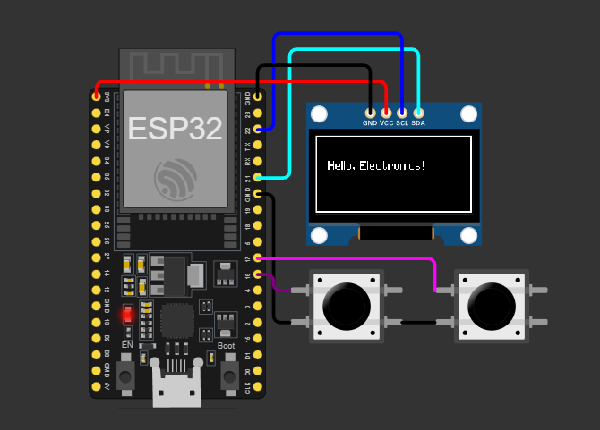

# SSD1306 GFX Driver for ESP-IDF & PlatformIO

A lightweight, fast, and feature-rich SSD1306 driver for Espressif microcontrollers. Written in pure C for maximum performance and full compatibility with ESP-IDF and PlatformIO. This code is compatible with both C and C++ environments.

<p align="center">
  
  
  
</p>

-----


## 📖 Description

This project provides a robust driver library for controlling SSD1306-based OLED displays (e.g., 128x64, 128x32, etc.) via I2C. Its API is inspired by the popular Adafruit GFX Library, offering a familiar and user-friendly interface for drawing shapes, rendering text with various fonts, and displaying bitmaps.

Designed for efficiency and modularity, this library integrates seamlessly into your ESP-IDF or PlatformIO projects, making it an ideal choice for IoT applications, instrument panels, or simple user interfaces.

## ✨ Showcase

Here’s a simple example of what you can display using this library:

<p align="center">
  
</p>

You can also simulate this driver directly using Wokwi. I have included Wokwi assets such as `diagram.json` and `wokwi.toml` in the `assets/wokwi` folder. For a detailed tutorial on using Wokwi, please refer to the `readme.md` file located in the same `assets` folder.

## 🛠️ Tech Stack & Requirements

### Hardware
- ESP32 microcontroller (or variants like ESP32-S2, S3, C3).
- SSD1306-based OLED display connected via I2C.

### Software
- Visual Studio Code with the PlatformIO extension **OR** Espressif IDF.
- ESP-IDF v4.4 or later.
- Git for cloning the repository.

## 📋 Getting Started

Follow these steps to integrate and use the library in your project.

### 1. Add the Library to Your Project
Choose the method that matches your framework.

#### A) For PlatformIO
Add this repository URL to your `platformio.ini` file under `lib_deps`:

```ini
[env:esp32dev]
platform = espressif32
board = esp32dev
framework = espidf

lib_deps =
    https://github.com/Ariif0/espIdf_ssd1306_i2c.git
```

#### B) For ESP-IDF
The recommended approach is using the ESP-IDF Component Manager. Add the dependency to your `idf_component.yml` file at the project root:

```yaml
dependencies:
  idf: ">=4.4"
  # Replace 'Ariif' with your namespace if needed
  Ariif0/ssd1306:
    version: "*" # or ">=1.0.0"
    git:  https://github.com/Ariif0/espIdf_ssd1306_i2c.git
```

Then run:
```bash
idf.py reconfigure
```

#### Alternative for ESP-IDF (Git Submodule)
Add it as a submodule in your project’s `components` directory:

```bash
git submodule add https://github.com/Ariif0/espIdf_ssd1306_i2c.git components/ssd1306
```

### 2. Quick Start Code Example
Once the library is added, you can use it in your `main.c`:

```c
#include "freertos/FreeRTOS.h"
#include "freertos/task.h"
#include "esp_log.h"
#include "ssd1306.h"

// Define I2C pins and configuration
#define I2C_MASTER_SCL_IO   22
#define I2C_MASTER_SDA_IO   21
#define I2C_MASTER_NUM      I2C_NUM_0
#define OLED_I2C_ADDRESS    0x3C

static const char *TAG = "SSD1306_EXAMPLE";

void app_main(void)
{
    // 1. Configure the display
    ssd1306_config_t config = {
        .i2c_port = I2C_MASTER_NUM,
        .sda_pin = I2C_MASTER_SDA_IO,
        .scl_pin = I2C_MASTER_SCL_IO,
        .i2c_clk_speed_hz = 400000,
        .i2c_addr = OLED_I2C_ADDRESS,
        .screen_width = 128,
        .screen_height = 64,
        .rst_pin = -1 // Use -1 if RST pin is not connected
    };

    // 2. Create display handle
    ssd1306_handle_t oled_handle = NULL;
    esp_err_t ret = ssd1306_create(&config, &oled_handle);

    if (ret != ESP_OK) {
        ESP_LOGE(TAG, "Failed to initialize display: %s", esp_err_to_name(ret));
        return;
    }

    // 3. Start drawing
    ssd1306_clear_buffer(oled_handle);
    ssd1306_draw_rect(oled_handle, 0, 0, 127, 63, OLED_COLOR_WHITE);
    ssd1306_set_cursor(oled_handle, 10, 28);
    ssd1306_print(oled_handle, "Hello, Electronics!");
    
    // 4. Update screen to display the result
    // This function must be called after drawing
    ssd1306_update_screen(oled_handle);
}
```

### 3. Build and Upload
Use the standard commands for your framework to build and upload the firmware:

- **PlatformIO**: `pio run --target upload`
- **ESP-IDF**: `idf.py flash`

### 4. Monitor Output
Check the serial monitor for ESP32 logs:

- **PlatformIO**: `pio device monitor`
- **ESP-IDF**: `idf.py monitor`

## 📚 API Highlights

Below are some of the most commonly used functions. For a complete list with parameters, refer to `include/ssd1306.h`, which includes full Doxygen documentation.

| Function                  | Description                                      |
|---------------------------|--------------------------------------------------|
| `ssd1306_create(&cfg, &handle)` | Initializes the display and returns a unique handle. |
| `ssd1306_update_screen(handle)` | Sends the framebuffer content to the display. Must be called after drawing. |
| `ssd1306_clear_buffer(handle)` | Clears the entire framebuffer (sets to black). |
| `ssd1306_print(handle, "Text")` | Displays a string at the current cursor position. |
| `ssd1306_set_cursor(handle, x, y)` | Sets the starting position for printing. |
| `ssd1306_set_font(handle, &font)` | Sets the font to use (includes the default 5x7 font). |
| `ssd1306_draw_bitmap(...)` | Displays a monochrome bitmap image. |
| `ssd1306_draw_line(...)` | Draws a line between two points. |
| `ssd1306_fill_circle(...)` | Draws a filled circle. |

## 🙏 Acknowledgments

This library is heavily inspired by the outstanding work of Adafruit with their [Adafruit GFX Library](https://github.com/adafruit/Adafruit-GFX-Library), which has become the de-facto standard for graphics on microcontrollers. Special thanks also go to the Espressif community for their excellent ESP-IDF framework, which provides the foundation for this driver. Additionally, I appreciate the feedback and contributions from early adopters and testers, whose insights have helped shape this project. 

## 🤝 Contributing

Contributions of any kind are welcome! If you find bugs, have feature ideas, or want to make improvements, please open an Issue or submit a Pull Request.

## 👤 Author

Developed and maintained by Muhamad Arif Hidayat.

## 📜 License

This project is licensed under the MIT License. See the [LICENSE](LICENSE) file for details.

